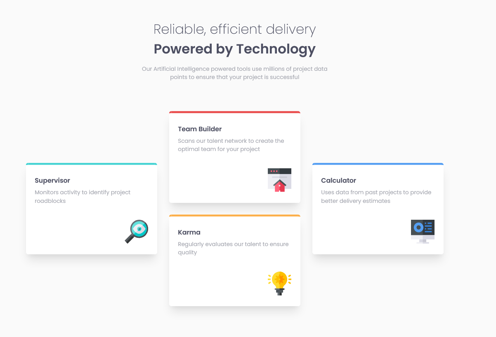

# FEM - Card Feature Section

This is a solution to the [Four card feature section challenge on Frontend Mentor](https://www.frontendmentor.io/challenges/four-card-feature-section-weK1eFYK).

## Table of contents

- [Overview](#overview)
  - [The challenge](#the-challenge)
  - [Screenshot](#screenshot)
  - [Links](#links)
- [My process](#my-process)
  - [Built with](#built-with)
  - [What I learned](#what-i-learned)
  - [Continued development](#continued-development)

## Overview

### The challenge

- View the optimal layout for the site depending on their device's screen size

### Screenshot

### Links

- Solution URL: [https://github.com/chucksterv/fem-card-feature-grid]
- Live Site URL: [https://4-card-features.projects.deshand.com]

## My process

This was a fun one to build.

- At small screen sizes, it will stick to one column.
- At medium screen sizes, it will autofit with a minimum with of 21.5em per grid element.
- At larger screen sizes, it will reflect the design file with grid elements given specific content placement.

### Built with

- Semantic HTML5 markup
- CSS custom properties
- CSS Grid
- Mobile-first workflow
- BEM
- SASS

### What I learned

This was a good refresher on CSS Grid and I learned a the difference between auto-fill & auto-fit as well as how the minmax function fits in with these two variables.
